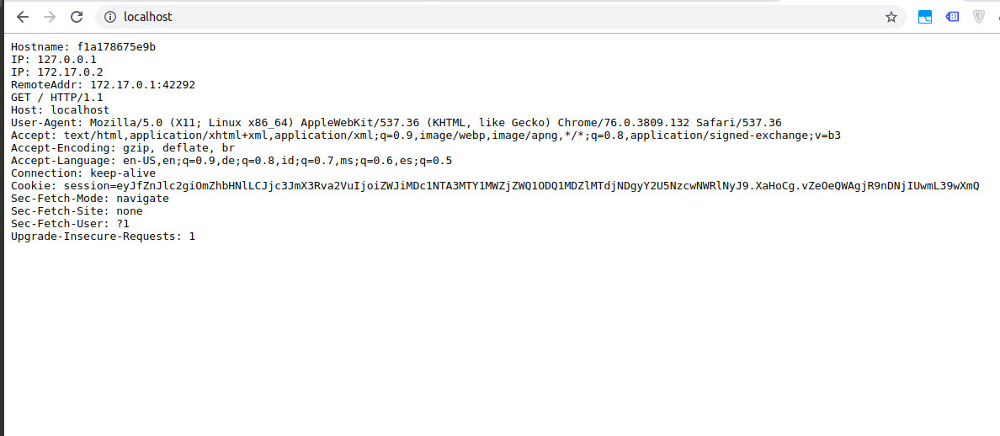
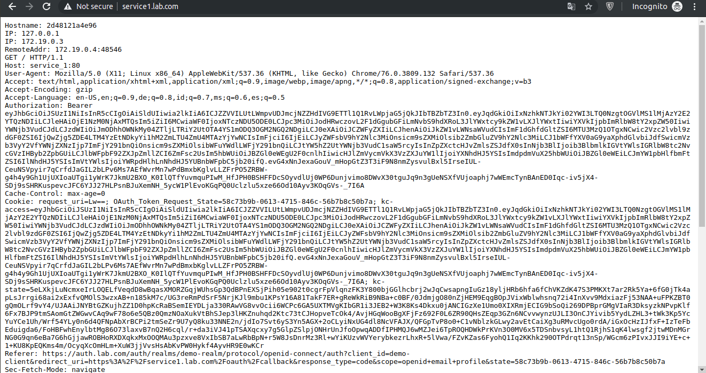

# Docker Keycloak IdP and Traefik Workshop

This repo is made based on https://github.com/ibuetler/docker-keycloak-traefik-workshop

For the sake of this tutorial I have chosen the whoami Docker image we want to add authentication using Keycloak. The whoami application is a tiny Go webserver that prints os information and HTTP request to output. The whoami sample application is not asking for a username and password. You can grab the whoami docker from https://hub.docker.com/r/containous/whoami . The whoami web port is listening on port `80`.

## Test Running Application

```sh
docker pull containous/whoami
docker run --rm -i -p 80:80 containous/whoami
CTRL+C will stop the docker
```

See the screenshot below how to pull and run and test whoami



Once you're good, please stop the docker in the same terminal you have executed "docker run..." by pressing CTRL-C. This will shutdown the whoami docker service. It must be shutdown for the next steps.

## Step 1: Add three hosts into /etc/hosts

Before you can test the traefik and whoami daemon, you must add three host entries into the /etc/hosts file. This is, because we do the demo without real DNS names.

```sh
echo "127.0.0.1       service1.lab.com" >> /etc/hosts
echo "127.0.0.1       auth.lab.com" >> /etc/hosts
echo "127.0.0.1       traefik.lab.com" >> /etc/hosts
```

## Step 2: Run via Docker Compose

This command will run Traefik, Keycloak (and it's database), Keycloak-gateway, and Whoami service.

```sh
docker-compose up -d
```

## Step 3: Keycloak Setup

For the sake of this tutorial I use keycloak, an open-source identity provider `IdP` that runs smoothly with docker. If you don’t know keycloak, I encourage you to get into this project. It is the open source version of the RedHat RH-SSO solution.

Afterwards, you should be able to use Firefox to reach your newly created IdP.

* https://auth.lab.com/

Traefik is issuing another self-signed TLS certificate.


Please proceed again and you should see the IdP login prompt.


```txt
username: admin
password: password
```


And voilà, your keycloak IdP should be up and working


### Create New Realm in Keycloak

Follow steps below:

1. Click "Add realm" button on the top left of the admin dashboard. Create a new realm with this data:
   * Name = `demo-realm`
1. Click "Login" tab, then configure this value:
   * User registration = `ON`
1. Click "Create"

### Create New Client in Keycloak

Follow steps below:

1. Click on "Clients" in the left menu
1. Click on "Create", then configure these values:
   * Client ID = `demo-client`
1. Click "Save"
1. Edit this field:
   * Access Type = `confidential`
   * Valid Redirect URIs = `https://service1.lab.com/*`
1. After saving, please click the "Credentials" menu item where you will find the secret we need for keycloak-gatekeeper. Copy the Secret as you need it later when configuring `keycloak-gatekeeper`

### Create Client Audience and Scope

With the new Keycloak software, a user must be assigned to a valid audience and scope before he or she can use a keycloak enabled service. Thus, let's configure the audience and scope.

Follow steps below:

1. Click on "Client Scopes" in the left menu and press "Create"
1. Use this data:
   * Name = `demo-scopes`
1. Click "save"
1. Click on "Mappers" tab and click "Create" button. Please configure the mapper the same as in the list below.
   * Name = `demo-client-mapper`
   * Mapper Type = `Audience`
   * Included Client Audience = `demo-client`
   * Add to ID token = `ON`
   * Add to access token = `ON`

### Apply Mapper to Client

Last, you must apply the newly created mapper to your `demo-client` client configuration.

Follow steps below:

1. Click on "Clients" in the left menu
1. Click "Edit" button next to `demo-client`
1. Click "Client Scopes" tab
1. On "Default Client Scopes" section, select `demo-scopes` on "Available Client Scopes" list and click "Add selected" button so that it will move to "Assigned Default Client Scopes" list

Now you have successfully finished the keycloak configuration for the new client application.

### Testing User Self-Registration

Please start in Firefox a "New Private Window" and connect to the following URL

https://auth.lab.com/auth/realms/demo-realm/account


Please register a new account


Enter your data here


Use your Firefox instance where you are logged-in as `admin` and check if the user has been created. 

PS: you can setup the user directly within keycloak, if you want. This steps were more to say: "hey, users can self-register in keycloak"


## Step 4: Keycloak Gatekeeper Setup

### Configure Client Secret

Please configure your keycloak-gatekeeper with your client secret.

```sh
nano keycloak-gatekeeper.conf
```

Please specify:

* discovery-url: https://auth.lab.com/auth/realms/demo-realm
* client-id: `demo-client`
* client-secret: `<your-client-secret>`
* redirection-url: https://service1.lab.com
* upstream-url: http://service_1:80/

If you don't remember, the client secret comes from the client configuration tab. Copy your value from there.

## Step 5: Refresh `keycloak-gatekeeper` Service

The `keycloak-gatekeeper` needs to read new configuration file. So, we have to restart the service using this command

```sh
docker-compose restart keycloak-gatekeeper
```

## Step 6: Testing whoami via traefik

Ok, then let's see how it works using the browser.

Please open Firefox and point your browser to https://service1.lab.com

Follow registration step and then login using the new username and password.

You can see the `whoami` service is running and also displaying the token information.



## Step 7: Authenticate Using API Endpoint

Use Postman and make this request

```curl
curl -X POST \
  https://auth.lab.com/auth/realms/demo-realm/protocol/openid-connect/token \
  -H 'Accept: */*' \
  -H 'Accept-Encoding: gzip, deflate' \
  -H 'Cache-Control: no-cache' \
  -H 'Connection: keep-alive' \
  -H 'Content-Length: 127' \
  -H 'Content-Type: application/x-www-form-urlencoded' \
  -H 'Host: auth.lab.com' \
  -H 'Postman-Token: 24099870-cba6-41a8-8d85-dde5408faa2b,963f8ac0-23e1-430d-b69a-aadf452959bb' \
  -H 'User-Agent: PostmanRuntime/7.19.0' \
  -H 'cache-control: no-cache' \
  -d 'client_id=demo-client&grant_type=password&username=asatrya&password=password&client_secret=2a3d0e8d-d605-49ce-b65d-c244399d15e3'
```

You will get `access_token` as the response. Copy this token as you will need in next steps.

## Step 8: Access Service Using Endpoint API

Use Postman to make this request:

```curl
curl -X GET \
  https://service1.lab.com \
  -H 'Accept: */*' \
  -H 'Accept-Encoding: gzip, deflate' \
  -H 'Authorization: Bearer YOUR-ACCESS-TOKEN' \
  -H 'Cache-Control: no-cache' \
  -H 'Connection: keep-alive' \
  -H 'Host: service1.lab.com' \
  -H 'Postman-Token: e77b0a50-42df-4503-9d34-34262f1bc61d,6547e1d8-4af4-455f-a72d-dcbe3ae6c5b7' \
  -H 'User-Agent: PostmanRuntime/7.19.0' \
  -H 'cache-control: no-cache'
```

## THE END

After this tutorial you should have an application (whoami) that comes without authentication and authorization secured using traefik, keycloak and keycloak-gateeeper. The steps taken in this tutorial hopefully have guided you to the end - to a working setup.
